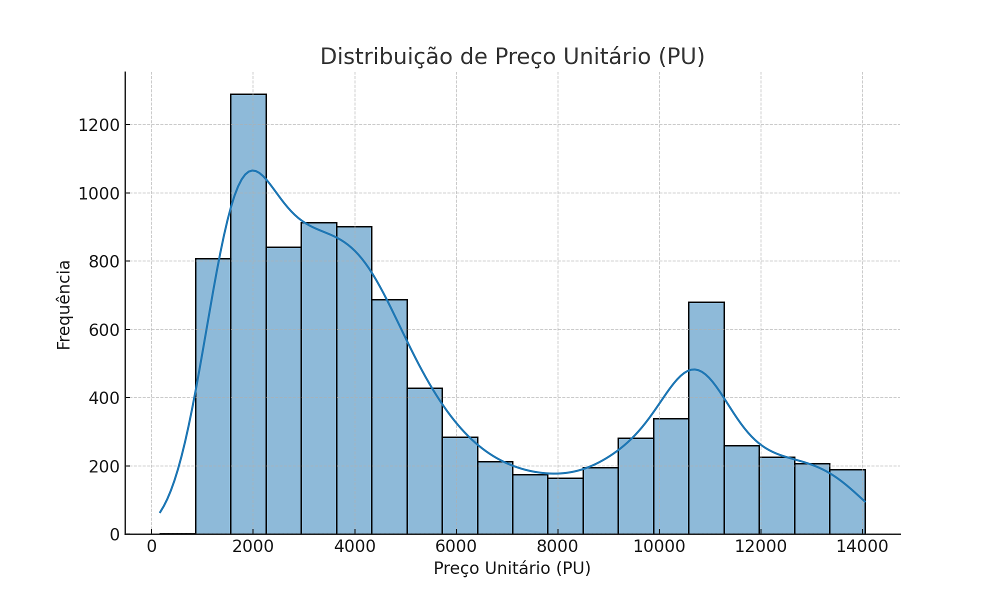
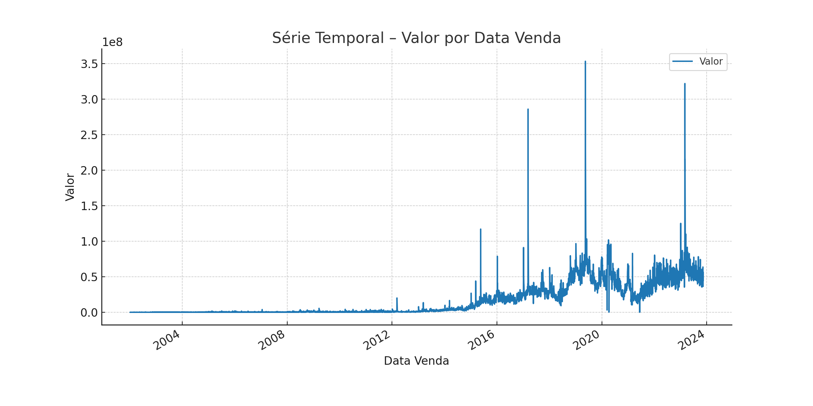
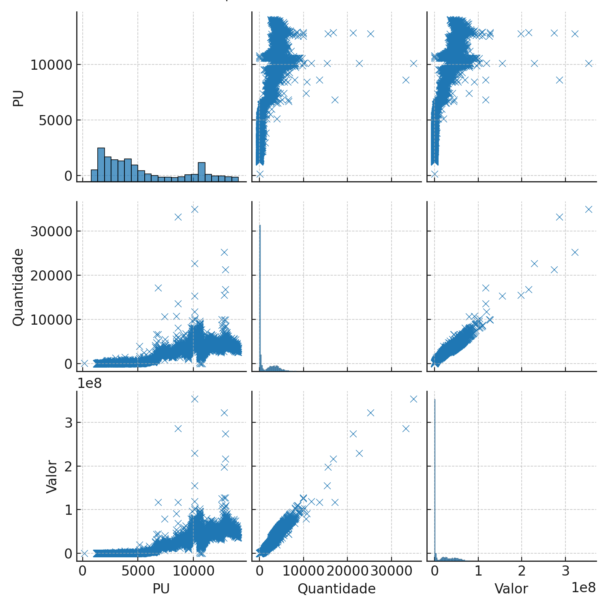
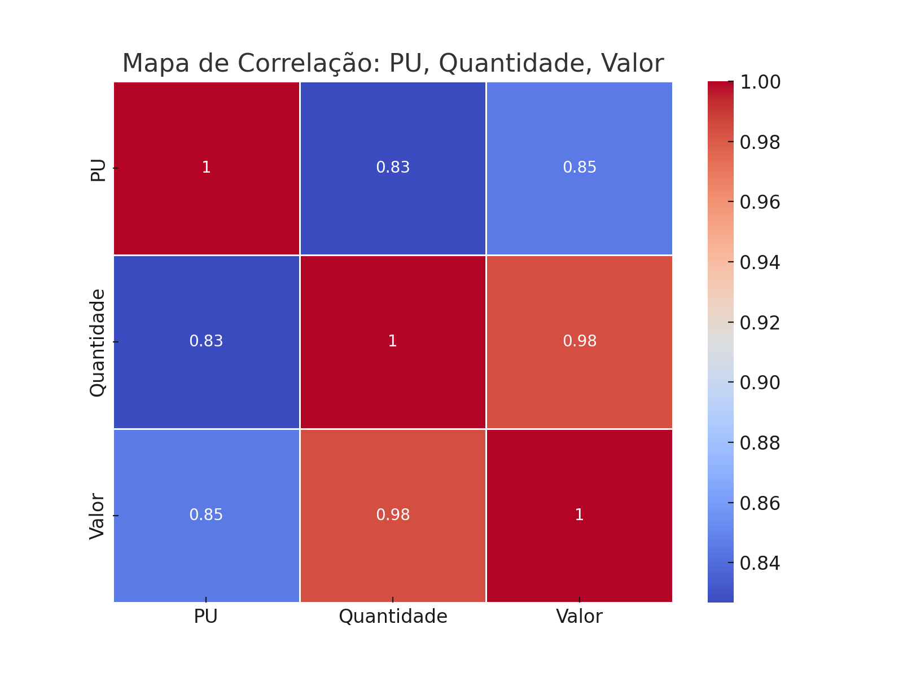

# Previsão de Valor do Tesouro Selic com Machine Learning

Este projeto aplica técnicas de **Ciência de Dados** e **Machine Learning** para analisar dados históricos de operações com o Tesouro Selic e prever o valor de venda de títulos com base em variáveis como PU, quantidade e datas. Foi desenvolvido como projeto acadêmico na área de Big Data e Data Science.

---

## Objetivo

- Analisar dados reais do Tesouro Selic.
- Aplicar modelos de regressão para prever o valor de venda de uma operação.
- Visualizar relações entre variáveis financeiras.
- Avaliar desempenho de diferentes modelos de machine learning.

---

## Estrutura do Repositório

```
previsao-valor-selic/
├── 📄 README.md                           # Documentação do projeto
├── 📄 requirements.txt                    # Bibliotecas necessárias
├── 📄 pi_data_science_&_big_data.ipynb    # Notebook com etapas comentadas
├── 📄 VendasTesouroDireto.csv             # Base de dados original
├── 📁 images/                             # Gráficos gerados para análise
│   ├── histograma_pu.png
│   ├── serie_temporal_valor.png
│   ├── pairplot_pu_quantidade_valor.png
│   └── heatmap_correlacao.png
```

---

## Etapas Desenvolvidas

### 1. Introdução e Objetivo

Explicação do problema e justificativa da abordagem.

### 2. Carregamento e Limpeza dos Dados

- Conversão de datas (`Data Venda`, `Vencimento`)
- Conversão de valores financeiros de string para float
- Filtragem para títulos do tipo **Tesouro Selic**

### 3. Análise Exploratória (EDA)

Visualizações importantes extraídas do dataset:

#### 🔹 Distribuição do PU



#### 🔹 Série Temporal de Valores



#### 🔹 Relação entre PU, Quantidade e Valor



#### 🔹 Correlação Entre Variáveis



### 4. Modelagem e Treinamento

Modelos aplicados:

- Regressão Linear
- K-Nearest Neighbors (KNN)
- Random Forest Regressor

### 5. Avaliação dos Modelos

Métricas utilizadas:
- **MAE** – Erro absoluto médio
- **MSE** – Erro quadrático médio
- **R²** – Coeficiente de determinação

---

## Tecnologias Utilizadas

- Python 3.x
- Pandas, NumPy
- Seaborn, Matplotlib
- Scikit-learn
- Statsmodels (para extensões futuras com séries temporais)

---

## Limitações e Melhorias Futuras

- O modelo atual **não prevê a taxa Selic diretamente**, apenas o valor de venda da operação.
- A classificação de risco pode ser melhorada com base em dados financeiros mais robustos.
- Pode ser integrado a uma aplicação web com Flask para uso interativo.
- Possível extensão com modelos de séries temporais (ARIMA, Prophet, LSTM).

---

## Autores

Desenvolvido por [Gustavo Oliveira](https://github.com/oliverbaggins), [Luiz Lopes](https://github.com/luizlopesbr) e [Rodolfo Jorge](https://www.linkedin.com/in/orodolfojorge/) como parte da disciplina de Data Science e Big Data do curso de Sistemas de Informação.

---

## Licença

Este projeto é acadêmico e sem fins lucrativos.
